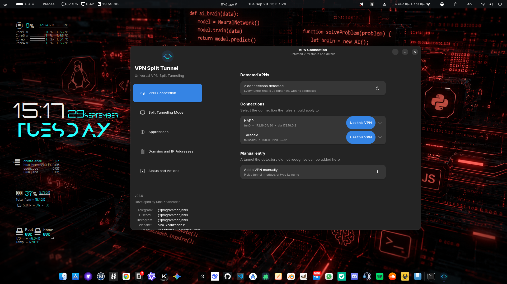

# مدیریت تونل جدا شده‌ی VPN (VPN Split Tunnel)

[](https://www.gnu.org/licenses/gpl-3.0.html)
[](https://www.python.org/)
[](https://gtk.org/)
[](https://gnome.pages.gitlab.gnome.org/libadwaita/)

**مدیر جامع تونل جدا شدهٔ VPN برای لینوکس** — یک برنامهٔ گرافیکی GTK4 / libadwaita
که ترافیک *انتخاب‌شده* (برنامه‌ها، دامنه‌ها و بازه‌های IP) را از تونل VPN عبور
می‌دهد و بقیهٔ ترافیک را روی اتصال مستقیم نگه می‌دارد — یا دقیقاً برعکس — و با
همهٔ کلاینت‌های اصلی VPN کار می‌کند، بدون اینکه خودش VPN را روشن، خاموش یا
پیکربندی کند.

برنامه به‌طور کامل به دو زبان **انگلیسی** و **فارسی (راست‌به‌چپ)** بومی‌سازی شده
است.

> 🌐 **English:** [the English version is here](readme.md)

## تصویر برنامه



---

## فهرست مطالب

- [مشکل](#مشکل)
- [راه‌حل](#راهحل)
- [امکانات](#امکانات)
- [راهنمای محیط کاربری — هر منو، بخش، فیلد، ورودی و دکمه](#راهنمای-محیط-کاربری)
  - [پنجرهٔ اصلی](#پنجره-اصلی)
  - [۱. صفحهٔ اتصال VPN](#۱-صفحه-اتصال-vpn)
  - [۲. صفحهٔ حالت تونل جدا شده](#۲-صفحه-حالت-تونل-جدا-شده)
  - [۳. صفحهٔ برنامه‌ها](#۳-صفحه-برنامهها)
  - [۴. صفحهٔ دامنه‌ها و آدرس‌های IP](#۴-صفحه-دامنهها-و-آدرسهای-ip)
  - [۵. صفحهٔ وضعیت و عملیات](#۵-صفحه-وضعیت-و-عملیات)
  - [گفتگوی تنظیمات](#گفتگوی-تنظیمات)
  - [گفتگوی درباره](#گفتگوی-درباره)
- [نحوهٔ کار](#نحوه-کار)
- [تضمین‌های حریم خصوصی و امنیت](#تضمینهای-حریم-خصوصی-و-امنیت)
- [نصب](#نصب)
- [وابستگی‌ها](#وابستگیها)
- [فایل پیکربندی](#فایل-پیکربندی)
- [خط فرمان](#خط-فرمان)
- [توسعه و تست](#توسعه-و-تست)
- [مشارکت](#مشارکت)
- [سازنده](#سازنده)
- [مجوز](#مجوز)
- [تقدیر و تشکر](#تقدیر-و-تشکر)

---

## مشکل

کلاینت‌های VPN در لینوکس بیشتر «همه یا هیچ» هستند. تقریباً همهٔ کلاینت‌ها می‌توانند
همهٔ ترافیک شما را از تونل عبور بدهند یا هیچ‌کدام — اما خیلی کم‌تر از آن‌ها
اجازه می‌دهند *بخشی* از ترافیک را تونل کنید:

- می‌خواهید **مرورگر و ترمینال روی VPN** باشند و یک بازی، دانلود یا سرویس محلی
  از اتصال **مستقیم** شما استفاده کند — یا دقیقاً برعکس.
- می‌خواهید **سایت‌های بانکی و دولتی** (`.ir` و …) از VPN عبور نکنند ولی بقیهٔ
  ترافیک از آن برود.
- می‌خواهید یک سایت پخش فیلم یا بانک **هرگز آی‌پی VPN شما را نبیند**.
- کلاینت‌هایی که «تونل جدا شده» دارند یا فقط از **همان اپلیکیشن خودشان**، یا فقط
  اپ‌هایی که می‌شناسند را پشتیبانی می‌کنند، یا فقط از خط فرمان و با فایروال
  دستی کار می‌کنند.

درست کردن این کار با دست یعنی نوشتن قوانین `nftables`، مسیریابی سیاستی `ip rule`
و — چون کرنل لینوکس سوکت‌های دو فرایند مختلف را فقط با **cgroup** از هم جدا
می‌کند — راه‌اندازی دستی `cgroup v2`. یک اشتباه کوچک بی‌صدا ترافیک را به مسیر
اشتباه نشت می‌دهد: اصل تونل جدا شده این است که دو طرف هرگز با هم قاطی نشوند و
یک قانون خراب آن‌ها را قاطی می‌کند.

## راه‌حل

**VPN Split Tunnel** یک مدیر گرافیکی (GTK4 + libadwaita) است که کار سخت را برای
شما انجام می‌دهد:

1. **پیدا می‌کند** — همهٔ تونل‌های VPN که *همین حالا* روی سیستم شما بالاست را
   با خواندن سیستم زنده شناسایی می‌کند؛ هرگز از یک لیست ثابت سازنده.
2. **به شما اجازه می‌دهد انتخاب کنید** — تونل هدف، حالت، برنامه‌ها، دامنه‌ها و
   بازه‌های IP/CIDR با کنترل‌های ساده و قابل کلیک.
3. **قبل از هر تغییری نشان می‌دهد چه خواهد شد** — پیش‌نمایشی که از جدول مسیریابی
   واقعی شما محاسبه می‌شود، بدون درخواست رمز و بدون هیچ تغییری در سیستم تا وقتی
   خودتان نخواهید.
4. **قوانین** `nftables` و مسیریابی سیاستی را با یک درخواست مجوز سرپرست
   (polkit) **می‌سازد و نصب می‌کند**.
5. هنگام فشردن **حذف قوانین** دقیقاً همان چیزی را که نصب کرده **حذف می‌کند**
   (و نه چیز دیگری).

برنامه دربارهٔ VPN شما **کاملاً فقط‌خواندنی** است: هیچ‌وقت یک تونل را متصل، قطع،
ری‌استارت یا تغییر پیکربندی نمی‌دهد — این کارِ کلاینت VPN خودتان است. برنامه فقط
آنچه در حال اجراست را می‌بیند و قوانین خودش را روی آن مدیریت می‌کند.

## امکانات

### 🔐 پشتیبانی چندگانهٔ VPN (شناسایی زنده)
هر تونلی که واقعاً بالاست ارائه می‌شود — از سیستم شناسایی می‌شود نه از لیست:
**WireGuard، OpenVPN، Tailscale، Xray / Sing-box / Clash.Meta (VLESS/VMESS/
Trojan)، Windscribe، HAP، VPNهای NetworkManager، systemd-networkd، تونل‌های
شبیه Proton** و هر چیز دیگر تونل‌شکل — که اگر تشخیص‌دهنده‌ها پیدا نکنند، می‌توان
با نام اینترفیس **دستی** هم اضافه کرد.

### 🎯 دو حالت تونل جدا شده
- **حالت Include (شامل):** فقط برنامه‌ها، دامنه‌ها و بازه‌های IP انتخاب‌شده از VPN
  عبور می‌کنند؛ بقیه روی اتصال مستقیم می‌مانند.
- **حالت Exclude (معکوس/جداکننده):** همه‌چیز از VPN عبور می‌کند **به‌جز**
  برنامه‌ها، دامنه‌ها و بازه‌های IP انتخاب‌شده.

### 🗂️ همهٔ برنامه‌های نصب‌شدهٔ شما در یک جا — و انتخاب با خود شماست
فهرست برنامه‌ها از **سیستم شما** می‌آید نه از یک مجموعهٔ ثابت: هر برنامهٔ
نصب‌شده (از فایل‌های `.desktop` شما) در یک فهرست قابل‌جستجو دیده می‌شود و
**شما** تصمیم می‌گیرید کدام‌ها در تونل قرار بگیرند. کلاینت‌های VPN وقتی «تونل
جدا شده» دارند، معمولاً فقط اپ خودشان یا چند برنامهٔ مشخص را پشتیبانی می‌کنند؛
اینکه خودتان بتوانید **هر** برنامهٔ نصب‌شده‌تان را انتخاب کنید قابلیتی است که
تعداد کمی از برنامه‌ها — به‌خصوص روی دسکتاپ — دارند.

### 🖥️ مسیریابی هر برنامه (cgroup v2)
ترافیک هر برنامه بر اساس **cgroup** فرایندش جدا می‌شود. برنامه، برنامه‌ها را
داخل slice سیستم‌د خودش اجرا می‌کند تا کرنل — و قوانین — بتوانند دقیقاً آن‌ها را
شناسایی کنند.

### 🌐 دامنه‌ها، IPها و بازه‌های CIDR
ویرایشگر لیست متنی ساده با ویرایش/حذف هر مورد، اعتبارسنجی، و ایمپورت/اکسپورت
فایل.

### 🔒 امنیت در طراحی
ارتقای مجوز با PolicyKit از طریق یک **helper اختصاصی** که فقط `ip` و `nft` را
می‌تواند اجرا کند؛ قوانین شمارنده دارند تا برنامه همیشه بداند دقیقاً کدام‌ها
مال خودش است.

### 🎨 رابط کاربری
GTK4 + libadwaita (ظاهرِ بومی در GNOME، و کار در KDE/XFCE و هر دسکتاپ دیگر)،
تم روشن/تاریک/سیستمی، زبان انگلیسی و فارسی (راست‌به‌چپ)، جستجو و tooltip روی
همهٔ کنترل‌ها.

---

## راهنمای محیط کاربری

### پنجرهٔ اصلی

یک **نوار کناری** (۲۶۰ پیکسل) با آیکون، عنوان و زیرعنوان برنامه؛ **فهرست
ناوبری** با پنج بخش؛ و در پایین، **نسخه** (`v0.1.0`)، متن *«ساخته شده توسط سینا
خان‌زاده»* و لینک‌های شبکه‌های اجتماعی سازنده (تلگرام، دیسکورد، اینستاگرام،
وب‌سایت، ایمیل — متن انتخابی/قابل کپی).

**نوار عنوان** عنوان/زیرعنوان بخش فعلی را نشان می‌دهد (با حرکت شما عوض می‌شود).
**منوی پنجره** (آیکون همبرگری):

- **تنظیمات** — گفتگوی تنظیمات را باز می‌کند (پایین‌تر).
- **درباره** — گفتگوی درباره را باز می‌کند (پایین‌تر).
- **خروج** — برنامه را می‌بندد.

---

### ۱. صفحهٔ اتصال VPN

*«وضعیت و جزئیات VPN شناسایی‌شده»* — همهٔ تونل‌هایی که همین حالا بالاست.

- **گروه VPNهای شناسایی‌شده:**
  - **ردیف خلاصه** — *«در حال بررسی…»* تا وقتی اسکن در جریان است، *«N اتصال
    شناسایی شد»* وقتی تونلی هست، یا *«به هیچ VPN متصل نیستید»*.
  - **دکمهٔ تازه‌سازی** (آیکون ↻، راهنمای *«دوباره اسکن کن»*) — سیستم را برای
    VPN دوباره اسکن می‌کند. فهرست برنامه‌های نصب‌شده را هم دوباره بارگیری
    می‌کند تا برنامهٔ تازه نصب‌شده هم ظاهر شود.
- **گروه اتصال‌ها** — یک ردیف بازشونده برای هر اتصال شناسایی‌شده:
  - **عنوان ردیف** — نام کلاینت VPN (مثلاً *«HAPP»*، *«Tailscale»*)؛ برای تونل
    ناشناخته به شکل *«Unknown VPN (tun0)»*.
  - **زیرعنوان ردیف** — خلاصهٔ یک خطی: `interface • آدرس‌ها • via gateway`.
  - **دکمهٔ «از این VPN استفاده کن»** (سبز، پیشنهادی، راهنمای *«Send the split
    tunnel through this VPN»* — تونل جدا شده را از این VPN بفرست) — این تونل را
    هدف قوانین می‌کند. پس از انتخاب، دکمه غیرفعال و برچسبش *«Rules target this
    VPN»* می‌شود و یک **(✓) نشان** کوچک روی ردیف ظاهر می‌شود.
  - **ردیف‌های جزئیات** (با کلیک روی فلش بازشونده): *Interface، Protocol، IP
    Addresses، Tunnel Peer، Gateway، DNS Servers، MTU، Processes، Also seen as،
    Config File*. آدرس‌ها و مسیرهای فایل **قابل انتخاب/کپی** هستند.
- **گروه ورودی دستی** — برای تونل‌هایی که تشخیص‌دهنده‌ها نشناختند:
  - ردیف **«افزودن دستی VPN»** با دکمهٔ **+** (راهنمای *«Register a tunnel the
    detectors missed»*). گفتگویی باز می‌شود با یک **فیلد متنی** (از قبل با اولین
    اینترفیس کاندید از `ip link` پر شده) و دکمه‌های **انصراف / افزودن**. اینترفیسی
    که تایپ کنید (مثلاً `tun0`، `wg0`) همان جزئیات کامل یک تونل اسکن‌شده را می‌گیرد.
- **حالت خالی** (هیچ VPNی پیدا نشده): آیکون بزرگ محو، *«به هیچ VPN متصل
  نیستید»* و دکمهٔ قرصی **«افزودن دستی VPN»**.

> هیچ‌چیز در این صفحه کلاینت VPN را اجرا نمی‌کند. فقط آنچه تشخیص‌دهنده‌های
> غیرفعال از سیستم یاد گرفته‌اند را نمایش می‌دهد.

---

### ۲. صفحهٔ حالت تونل جدا شده

*«انتخاب کنید که تونل جدا شده چگونه کار کند»* — یک گروه، دو انتخاب.

- رادیو **حالت Include (شامل)** — *«فقط برنامه‌ها و دامنه‌های انتخاب‌شده از VPN
  عبور می‌کنند؛ بقیه از اتصال مستقیم استفاده می‌کنند.»*
- رادیو **حالت Exclude (معکوس/جداکننده)** — *«همه‌چیز از VPN عبور می‌کند به‌جز
  برنامه‌ها و دامنه‌های انتخاب‌شده که از اتصال مستقیم استفاده می‌کنند.»*

با کلیک روی هر ردیف، رادیوی همان ردیف انتخاب می‌شود. صفحهٔ وضعیت این انتخاب را
به زبان ساده توضیح می‌دهد.

---

### ۳. صفحهٔ برنامه‌ها

*«برنامه‌هایی را انتخاب کنید که در تونل VPN قرار بگیرند یا حذف شوند.»*

- **گروه برنامه‌های نصب‌شده:**
  - چک‌باکس **«کل سیستم (اعمال روی همهٔ ترافیک)»** — به‌صورت پیش‌فرض **تیک
    خورده**؛ تونل جدا شده را روی همهٔ ترافیک سیستم اعمال می‌کند. تا وقتی تیک خورده
    باشد، فهرست برنامه‌ها و جستجو غیرفعال است.
  - **فیلد جستجو** (*«جستجوی برنامه‌ها…»*) — فهرست را زنده بر اساس نام یا شناسهٔ
    دسکتاپ فیلتر می‌کند.
  - **فهرست برنامه‌ها** (قابل اسکرول) — یک ردیف برای هر برنامهٔ نصب‌شده:
    - **آیکون + نام نمایشی + شناسهٔ دسکتاپ** در زیرنویس.
    - **چک‌باکس انتخاب** (راهنمای *«Select this application for the split
      tunnel»*) — برنامه را به سیاست اضافه/حذف می‌کند.
    - **دکمهٔ اجرا** (آیکون ▶، راهنمای *«Start this application so its traffic
      can be told apart»*) — برنامه را **داخل** slice سیستم‌د خود برنامه
      (`vpn-split-tunnel.slice`) اجرا می‌کند؛ تنها راهی که کرنل بعداً بتواند
      ترافیکش را جدا کند. اگر برنامه جای دیگری در حال اجراست، بنری توضیحی
      می‌گوید: اول ببندیدش، بعد از اینجا اجرا کنید.
    - وقتی برنامهٔ انتخاب‌شده داخل slice در حال اجراست، دکمهٔ اجرا به یک **نشان
      ✓ غیرفعال** تبدیل می‌شود، ردیف برجسته می‌شود و راهنما می‌شود *«This
      application is running where the split tunnel can see it»*.
  - **ردیف شمارش انتخاب** — *«ترافیک کل سیستم (پیش‌فرض)»* یا *«N برنامه
    انتخاب شد»* به‌همراه *«· M در حال اجرا»* یا *«· هنوز هیچ‌کدام اجرا نشده، پس
    قابل شناسایی نیستند»* — عدد دوم همان چیزی است که تصمیم می‌گیرد آیا سیاست
    واقعاً می‌تواند آن برنامه را جدا کند یا نه.
- **گروه موارد ردشده** (فقط وقتی پیش می‌آید) — فایل‌های دسکتاپی که قابل خواندن
  نبودند، با یک دلیل برای هر ردیف فهرست می‌شوند تا فهرست بی‌صدا کوتاه‌تر نشود.
- **گروه اعلان** (فقط وقتی پیش می‌آید) — هشدار ماندگار (نه toast گذرا) وقتی
  برنامهٔ اجراشده جایی ننشست که قوانین بتوانند شناسایی‌اش کنند.

---

### ۴. صفحهٔ دامنه‌ها و آدرس‌های IP

*«مدیریت دامنه‌ها و بازه‌های IP.»* — *«دامنه‌ها یا آدرس‌های IP را وارد کنید
(هر خط یکی). از نماد CIDR برای بازه‌های IP پشتیبانی می‌شود. به‌طور پیش‌فرض
خالی است.»*

- **ردیف افزودن دامنه:**
  - **فیلد متنی** (place holder: `example.com`) — دامنه را تایپ کنید و **Enter**
    بزنید.
  - **دکمهٔ «افزودن»** (راهنمای *«Add the domain above to the list»*).
  - موارد تکراری نادیده گرفته می‌شوند.
- **ردیف افزودن آدرس IP / CIDR:**
  - **فیلد متنی** (place holder: `192.168.1.0/24 or 10.0.0.1`) — اعتبارسنجی
    می‌شود؛ ورودی نامعتبر گفتگوی *«خطا»* باز می‌کند (*«نماد IP یا CIDR نامعتبر»*).
  - **دکمهٔ «افزودن»** (راهنمای *«Add the IP address or CIDR above to the
    list»*).
- **ردیف عملیات:**
  - **دکمهٔ «پاک کردن همه»** (سبک تخریبی، راهنمای *«Remove every domain and IP
    from the list»*) — اول تأیید می‌گیرد.
  - **دکمهٔ «وارد کردن از فایل»** (راهنمای *«Load domains and IPs from a text
    file»*) — انتخابگر فایل باز می‌کند؛ هر خط غیرخالی و غیر `#` افزوده و خودکار
    به‌عنوان IP/CIDR یا دامنه دسته‌بندی می‌شود.
  - **دکمهٔ «خروجی به فایل»** (راهنمای *«Save the current domains and IPs to a
    text file»*) — فایل متنی با کامنت و بخش‌های `# Domains` و `# IP Addresses /
    CIDR` می‌نویسد.
- **گروه فهرست فعلی:**
  - یک ردیف برای هر مورد با **نشان نوع** — **Domain / IP / CIDR**.
  - **دکمهٔ ویرایش** (آیکون ✎، راهنمای *«Edit this entry»*) — گفتگو با فیلد
    متنی و دکمه‌های **انصراف / ذخیره**.
  - **دکمهٔ حذف** (آیکون ✕/−، راهنمای *«Remove this entry»*).
  - برچسب حالت خالی وقتی چیزی اضافه نشده.

---

### ۵. صفحهٔ وضعیت و عملیات

*«اعمال یا حذف قوانین تونل جدا شده.»* — صفحه‌ای که قبل از تصمیم، حقیقت را می‌گوید
و صفحه‌ای که از آن اقدام می‌کنید.

- **کارت قوانین فعلی** — *«وقتی «اعمال قوانین» را بزنید چه چیزی اعمال می‌شود»*:
  - **VPN هدف** — تونل انتخابی به شکل *«client (interface)»* یا *«هیچ‌کدام انتخاب
    نشده»*.
  - **حالت** — صریح توضیح داده می‌شود: *«فقط برنامه‌ها و آدرس‌های انتخاب‌شده از
    VPN عبور می‌کنند»* (Include) یا *«همه‌چیز از VPN عبور می‌کند به‌جز
    برنامه‌ها و آدرس‌های انتخاب‌شده»* (Exclude).
  - **برنامه‌ها** — *«ترافیک کل سیستم»* یا *«N برنامه»*.
  - **دامنه‌ها و آدرس‌های IP** — *«هیچ»* یا *«N دامنه، N بازهٔ IP»*.
- **کارت «چه خواهد شد»** — *«بر اساس جدول مسیریابی فعلی سیستم، قبل از هر
  تغییری»*:
  - **نتیجه** — موتور مسیریابی با **بدون هیچ فرمان مجاز و بدون درخواست رمز**
    محاسبه می‌کند: ترافیک نشان‌دار از چه مسیری می‌رود (تونل یا مسیر عادی)، چند
    برنامهٔ انتخابی در جایی اجرا می‌شوند که قوانین بتوانند شناسایی‌شان کنند، و
    کدام دامنه‌ها قابل resolve نبودند.
  - **نکاتی که باید بدانید** (گروه جداگانه، فقط وقتی مهم است) — یک ردیف
    *«توجه»* برای هر هشدار، مثلاً: قوانین پایانی کلاینت VPN شما جلوتر از قوانین
    ما اجرا می‌شوند (اولویت *Rule Priority* را در تنظیمات پایین بیاورید)، کلاینت
    از قبل همه‌چیز را تونل می‌کند، یا یک برنامهٔ انتخابی هنوز در گروه قابل
    شناسایی اجرا نشده.
- **کارت عملیات:**
  - **خط وضعیت** — *«وضعیت: آماده / در حال اعمال… / فعال / خطا»* به‌همراه یک خط
    جزئیات مثل *«آماده برای اعمال روی wg0»*، *«روی wg0 اعمال شد»*، *«هیچ VPNی
    انتخاب نشده»* یا متن خطا.
  - **«حذف قوانین»** (قرمز، تخریبی، راهنمای *«Undo the rules this app
    applied»*) — همهٔ آنچه برنامه نصب کرده را حذف می‌کند (جدول nftables، قانون
    `ip rule`، جدول مسیریابی)؛ رمز سرپرست می‌خواهد. هر وقت قوانین فعال باشد فشردنی
    است.
  - **«اعمال قوانین»** (سبز، پیشنهادی، راهنمای *«Install the split-tunnel rules
    into the live network (asks for admin permission)»*) — قوانین را می‌سازد و
    نصب می‌کند؛ رمز سرپرست می‌خواهد. فقط وقتی VPN انتخاب شده **و** چیزی
    (برنامه/دامنه/IP) انتخاب شده فعال است.
  - **«بازنشانی به پیش‌فرض»** (دکمهٔ قرصی، راهنمای *«Clear the form and restore
    the initial settings»*) — گفتگوی تأیید، سپس: حالت به **Include** برگردد،
    **کل سیستم** انتخاب شود، دامنه‌ها/IPها خالی شوند و قوانین فعال هم حذف شوند.

> اعلان‌های دسکتاپ هر اعمال/حذف را تأیید می‌کنند (در تنظیمات قابل خاموش‌کردن).

---

### گفتگوی تنظیمات

از منوی پنجره باز می‌شود. سه صفحه:

**عمومی ← رفتار**
- کلید **«تشخیص خودکار VPN»** (به‌طور پیش‌فرض روشن) — اسکن VPNهای فعال هنگام
  شروع برنامه.
- کلید **«اعمال قوانین هنگام شروع»** — اعمال دوبارهٔ آخرین قوانین هنگام اجرای
  برنامه.
- کلید **«نمایش اعلان‌ها»** (به‌طور پیش‌فرض روشن) — اعلان دسکتاپ هنگام اعمال یا
  حذف قوانین.

**ظاهر ← پوسته**
- فهرست کشویی **«پوسته»** — **سیستم / روشن / تاریک** (فوری اعمال می‌شود).
- فهرست کشویی **«زبان»** — **سیستم / انگلیسی / فارسی** (نیاز به ری‌استارت؛ در
  فارسی کل رابط راست‌به‌چپ می‌شود).

**شبکه ← پیکربندی مسیریابی** (مقادیر پیشرفته‌ای که قوانین از آن ساخته می‌شوند)
- **اینترفیس VPN** — فیلد متنی، place holder: `tun0` (مثلا `tun0`، `wg0`،
  `xray_tun`).
- **شناسهٔ جدول مسیریابی** — اسپین‌باکس، ۱–۲۵۵، پیش‌فرض **۱۰۱** (جدول
  مسیریابی سیاستی).
- **نشان فایروال** — اسپین‌باکس، ۱–۲۱۴۷۴۸۳۶۴۷، پیش‌فرض **۵۵۵۵** (مقدار
  `fwmark` که قوانین می‌گذارند).
- **اولویت قانون** — اسپین‌باکس، ۱–۳۲۷۶۶، پیش‌فرض **۸۵۰۰**. ⚠ *عدد کمتر زودتر
  اجرا می‌شود؛ باید **پایین‌تر از** قوانین کلاینت VPN شما باشد وگرنه آن‌ها
  اولویت دارند و این‌ها هرگز اعمال نمی‌شوند.*
- **Slice سیستم‌د** — فیلد متنی، پیش‌فرض **`vpn-split-tunnel.slice`** (slice
  سیستم‌د برای شناسایی هر برنامه با cgroup v2).

### گفتگوی درباره

نام و آیکون برنامه، **نسخه**، سازنده *«سینا خان‌زاده»*، مجوز **GPL-3.0-or-later**،
وب‌سایت، ردیابی مشکل و اطلاعات تماس سازنده.

---

## نحوهٔ کار

```
                 ┌─────────────────────────────────────────────┐
                 │        VPN Split Tunnel (رابط گرافیکی)       │
                 │  اسکن زندهٔ VPN  فرم سیاست  برنامه/پیش‌نمایش   │
                 └───────────────┬─────────────────────────────┘
                                 │  اعمال / حذف (درخواست سرپرست)
                    ┌────────────▼─────────────┐
                    │  polkit                  │
                    │  com.github.sina.         │
                    │   vpn-split-tunnel.       │
                    │   {apply,remove}-policy   │
                    └────────────┬─────────────┘
                                 ▼
                 /usr/libexec/vpn-split-tunnel-helper
                 (root؛ فقط می‌تواند اجرا کند:  ip,  nft)
```

1. **شناسایی (غیرفعال).** تشخیص‌دهنده‌ها `/sys/class/net`، `ip -o link show`،
   آدرس‌دهی و مسیرهای اینترفیس و `systemctl` را می‌خوانند — برای WireGuard,
   OpenVPN, Tailscale, Xray/Sing-box, Windscribe, HAP, NetworkManager,
   systemd-networkd و یک fallback برای «هر اینترفیس تونل‌شکل». هیچ‌چیز هرگز اجرا
   نمی‌شود.

2. **برنامه‌ریزی بدون دست زدن به چیزی.** `plan()` با `ip rule show`
   (بدون مجوز) دقیقاً مجموعه قوانین و هشدارها را محاسبه و پیش‌نمایش را رندر
   می‌کند — تا قبل از هر درخواست رمز، واقعیت را ببینید.

3. **اعمال (از طریق polkit و helper).** helper فقط برنامه‌های لیست‌سفید (`ip`,
   `nft`) را اجرا می‌کند و خودش دوباره آن‌ها را چک می‌کند.
   - **nftables** جدول `inet vpn_split_tunnel`:
     - زنجیرهٔ `mark_output` (هوک route، اولویت mangle) ترافیک انتخاب‌شده توسط
       سیاست را نشان‌دار می‌کند. loopback و اینترفیس خود تونل را رد می‌کند؛
       برنامه‌ها با `socket cgroupv2 level N "path"`، IP/CIDRها با `ip daddr` و
       دامنه‌ها از طریق مجموعه‌های آدرس `vpn_addrs` / `vpn_addrs6` (حین اعمال
       resolve می‌شوند) تطبیق داده می‌شوند. هر قانون یک شمارنده دارد.
     - در حالت **Include** یک زنجیرهٔ `kill_postrouting` ترافیک نشان‌داری را که
       می‌خواهد *خارج از* تونل از سیستم خارج شود حذف می‌کند (حفاظت از نشت).
       حالت Exclude به kill switch نیاز ندارد.
   - **مسیریابی سیاستی.** ترافیک نشان‌دار با یک `ip rule` در اولویت پیکربندی‌شده
     هدایت می‌شود: `fwmark <mark>/0xFF0000 lookup <جدول ما>` (Include) یا
     `lookup main` (Exclude، یعنی مسیر مستقیم). نشان با `0xFF0000` ماسک
     می‌شود تا نشان‌های برنامه‌های دیگر (Tailscale `0x80000`، WireGuard
     `0xca6c`) هرگز با ما برخورد نکنند. IPv4 و IPv6 هر دو قانون می‌گیرند؛ حالت
     Include جدولی اضافه می‌کند که مسیر پیش‌فرضش **به peer واقعی تونل** که از
     کرنل خوانده می‌شود اشاره دارد — هرگز از یک مقدار پیکربندی‌شده.

4. **اجرای هر برنامه.** دکمهٔ ▶ اجرا می‌کند:
   `systemd-run --user --unit=app-<name> --slice=vpn-split-tunnel.slice <cmd>`.
   مسیر cgroup حاصل از خودِ systemd خوانده می‌شود؛ قوانین nftables فقط برای
   cgroupهایی صادر می‌شوند که وجود دارند **و** فرایند زنده دارند — قانون
   nftables اشاره به cgroup وجودنداشته کل جدول را رد می‌کند.

5. **حذف.** جدول نام‌بردهٔ nftables و قانون `ip` را با اولویت/نشان/هدف دقیقش
   حذف می‌کند، بعد جدول مسیریابی (v4 + v6) را flush می‌کند. هر مصنوع دقیقاً آدرس‌دهی
   می‌شود تا چیزی که مال کلاینت VPN یا ابزار دیگری است به‌اشتباه حذف نشود.

## تضمین‌های حریم خصوصی و امنیت

- **دربارهٔ VPN فقط‌خواندنی.** برنامه هرگز به اینترفیس تونل شما آدرس اضافه
  نمی‌کند، آن را بالا/پایین نمی‌کند و مسیرهای کلاینت VPN را جایگزین نمی‌کند.
- **کمترین مجوز.** grants پول‌کیت فقط به helper همین برنامه محدود است
  (`org.freedesktop.policykit.exec` که به `/usr/libexec/vpn-split-tunnel-helper`
  اشاره دارد)؛ اعمال و حذف دو اکشن جدا هستند. لیست‌سفید helper فقط `ip` و `nft`
  است.
- **حذف تمیز.** *حذف قوانین* سیستم را دقیقاً به وضعیت قبل از *اعمال قوانین*
  برمی‌گرداند.
- **هیچ‌چیز در پس‌زمینه اجرا نمی‌شود** و هیچ‌چیز هنگام ورود به سیستم اجرا نمی‌شود.
- روی **هر دسکتاپی** کار می‌کند (GNOME، KDE، XFCE و …)؛ روی KDE پنجرهٔ رمز را
  agent پول‌کیتِ KDE نشان می‌دهد.

## نصب

### گزینهٔ الف — پکیج Debian (`.deb`) — Debian / Ubuntu / Zorin / Mint و …

یک پکیج آماده کنار همین مخزن است — `vpn-split-tunnel_0.1.0_all.deb` (بدون نیاز به
ساخت):

```bash
sudo apt install ./vpn-split-tunnel_0.1.0_all.deb    # پیشنهادی — وابستگی‌ها خودکار
# یا: sudo dpkg -i vpn-split-tunnel_0.1.0_all.deb
```

### گزینهٔ ب — از سورس (meson)

```bash
git clone https://github.com/programmer-1998/vpn-split-tunnel.git
cd vpn-split-tunnel
meson setup builddir
sudo meson install -C builddir      # نیاز به مجوز root
```

نصب می‌کند: پکیج پایتون (`/usr/lib/python3/dist-packages/vpn_split_tunnel`)،
راه‌انداز (`/usr/bin/vpn-split-tunnel`)، helper دارای مجوز
(`/usr/libexec/vpn-split-tunnel-helper`)، ورودی `.desktop`، آیکون برنامه،
metainfo، سیاست polkit، bash completion، استایل‌شیت و فهرست فارسی
(`/usr/share/locale/fa/LC_MESSAGES/vpn-split-tunnel.mo`).

### اجرا

- از منوی برنامه‌ها: **VPN Split Tunnel** (در نشست فارسی با نام فارسی‌اش نمایش
  داده می‌شود).
- از ترمینال: `vpn-split-tunnel` (از `--version`، `--debug` و `--help` پشتیبانی
  می‌کند).
- **رفع‌اشکال کرش:** از ترمینال `vpn-split-tunnel --debug` را اجرا کنید. هر خط
  لاگی که برنامه تولید می‌کند — بارگذاری پیکربندی، تشخیص VPN، هر فرمان
  `nft`/`ip` که اجرا می‌شود، resolve دامنه‌ها، و هر خطا یا استثنای پوشش‌نداده —
  در ترمینال چاپ می‌شود. این خروجی را در گزارش باگ بچسبانید تا مشکل قابل
  بازتولید باشد.

در هیچ جای ساخت، ابزار gettext لازم نیست — فایل‌های ترجمه با اسکریپت‌های همراه
پروژه کامپایل می‌شوند (`tools/msgfmt.py`، `tools/sync_pot.py`).

## وابستگی‌ها

**اجرا:** پایتون 3.10+ · GTK 4.10+ (`gir1.2-gtk-4.0`) · libadwaita 1.4+
(`gir1.2-adw-1`) · `python3-gi` + `gir1.2-glib-2.0`/`gir1.2-gio-2.0` ·
`nftables` · `iproute2` · سیستم‌د (cgroup v2 + `systemd-run`) · polkit +
`pkexec`. همه در مخازن استاندارد همهٔ توزیع‌های اصلی موجودند.

**نصب روی Debian / Ubuntu / Zorin / Mint و…** (برای `.deb` آماده هیچ‌کدام لازم
نیست — `apt` همه را خودکار حل می‌کند؛ این دستورات فقط برای ساخت یا اجرا از
خروجی سورس لازم‌اند):

```bash
sudo apt install \
  python3 python3-gi python3-gi-cairo \
  gir1.2-gtk-4.0 gir1.2-adw-1 gir1.2-glib-2.0 gir1.2-gio-2.0 \
  libgtk-4-dev libadwaita-1-dev \
  nftables iproute2 policykit-1 \
  meson ninja-build
```

**ساخت:** meson 1.2+ و پایتون 3.10+ (کامپایلر `.po`→`.mo` یک اسکریپت پایتونی
همراه پروژه است). هنگام اجرا از خروجی سورس، اگر پایتون نتواند `gi` را ایمپورت
کند:

```bash
pip3 install --user pycairo pygobject
```

## فایل پیکربندی

تنظیمات در `~/.config/vpn-split-tunnel/config.ini` ذخیره می‌شود (خودکار ساخته
می‌شود، سازگار با XDG):

```ini
[routing]
tun_device = tun0                        # آخرین اینترفیس تونل استفاده‌شده
fwmark = 5555                            # نشان فایروال
routing_table = 101                      # شناسهٔ جدول مسیریابی سیاستی
rule_priority = 8500                     # باید پایین‌تر از قوانین کلاینت VPN شما باشد
cgroup_slice = vpn-split-tunnel.slice    # slice سیستم‌د برای cgroup v2

[policy]
mode = include                           # include | exclude

[ui]
theme = system                           # system | light | dark
language = system                        # system | en | fa
```

مهم‌ترین کلید: **`rule_priority`** — قوانین مسیریابی با عدد کمتر زودتر اجرا
می‌شوند. اگر کلاینت VPN شما قوانینی پایین‌تر از این مقدار نصب کند، آن‌ها اولویت
دارند و این‌ها هرگز اعمال نمی‌شوند؛ برنامه این را تشخیص می‌دهد و هشدار می‌دهد.

## خط فرمان

```
vpn-split-tunnel [--version] [--debug] [--help]
```

- `--version` — نسخه را چاپ می‌کند و خارج می‌شود.
- `--debug` — لاگ‌گرفتن کامل debug را در ترمینال فعال می‌کند (بارگذاری
  پیکربندی، تشخیص VPN، هر فرمان `nft`/`ip`، resolve دامنه‌ها، خطاها و
  استثناهای پوشش‌نداده). برای گزارش کرش در نظر گرفته شده است.
- `--help` — راهنمای استاندارد گزینه‌های GLib.

## توسعه و تست

```bash
cd vpn-split-tunnel
python3 -m venv venv && source venv/bin/activate
pip install pytest pygobject
bash build.sh test          # یا: PYTHONPATH=src python3 -m pytest tests/ -q
```

اجرای بدون نصب:

```bash
PYTHONPATH=src python3 -m vpn_split_tunnel
```

## مشارکت

1. مخزن را fork کنید.
2. یک شاخهٔ feature بسازید.
3. تغییرات خود را اعمال کنید.
4. تست‌ها را اجرا کنید: `bash build.sh test` (یا `PYTHONPATH=src python3 -m pytest tests/ -q`).
5. لینتر را اجرا کنید: `ruff check .`
6. یک Pull Request باز کنید.

**ترجمه‌ها** در `resources/locale/<lang>/LC_MESSAGES/` هستند. برای همگام‌سازی
فهرست با کد (بدون نیاز به gettext): `python3 tools/sync_pot.py`، بعد فایل `.po`
را ویرایش و با `python3 tools/msgfmt.py <lang>.po <lang>.mo` کامپایل کنید.

## سازنده

**VPN Split Tunnel** توسط **سینا خان‌زاده** ساخته شده است — همان اطلاعاتی که در
گفتگوی «درباره» و نوار کناری برنامه می‌بینید:

| روش تماس | شناسه |
|---|---|
| تلگرام | `@programmer_1998` |
| دیسکورد | `@programmer_1998` |
| اینستاگرام | `@programmer_1998` |
| وب‌سایت | [sina-khanzadeh.ir](https://sina-khanzadeh.ir) |
| ایمیل | [khanzadeh.1377@gmail.com](mailto:khanzadeh.1377@gmail.com) |
| ردیابی مشکل | [github.com/programmer-1998/vpn-split-tunnel/issues](https://github.com/programmer-1998/vpn-split-tunnel/issues) |

## مجوز

**GPL-3.0-or-later** — جزئیات در [LICENSE](LICENSE).

## تقدیر و تشکر

- [netslice](https://github.com/occasion-2/netslice) — رویکرد cgroup v2 +
  nftables که این برنامه از آن الهام گرفته است.
- [مستندات تونل جدا شدهٔ پیشرفتهٔ Mullvad برای لینوکس](https://mullvad.net/en/help/split-tunneling-with-linux-advanced)
  — مستندات مکانیزم.
- [libadwaita](https://gnome.pages.gitlab.gnome.org/libadwaita/) — ویجت‌های
  مدرن GTK4.
- [PyGObject](https://pygobject.gnome.org/) — بایندینگ‌های پایتون برای GTK.